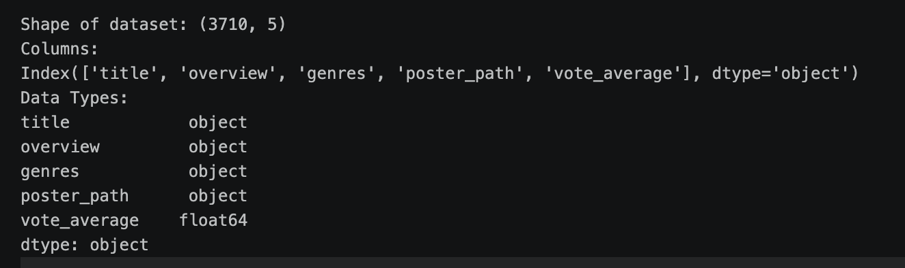
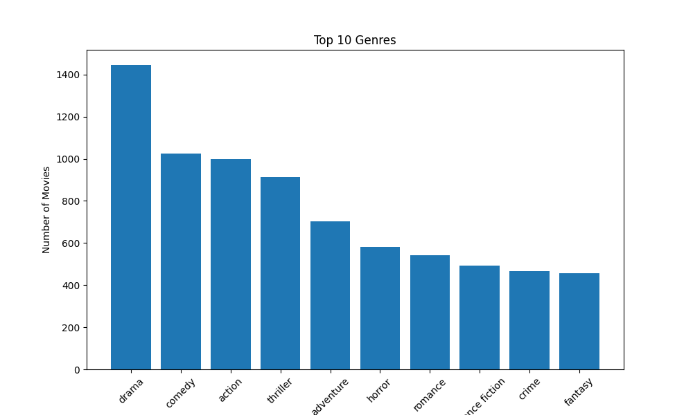
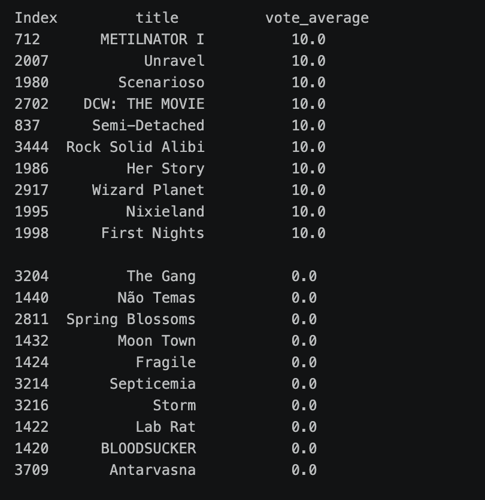

# Smart Movie Recommendation System

## Project Overview

This **Smart Movie Recommendation System** is a content-based recommendation project that aims to recommend movies based on their descriptions (overview), genres and other given input. The first phase of the project focuses on building a reliable dataset by collecting movie information from **TMDB**, cleaning the data, and performing Exploratory Data Analysis (EDA).

---

# Objectives

-Collection of data from the database and performing cleaning and exploratory data analysis of this clean data.

---

# Data Collection

The dataset was collected from **The Movie Database (TMDB)** through the API.

This API provides:

- Movie Title
- Overview
- Genres
- Poster Path
- Average Rating etc..

---

# Data Cleaning

After collecting the raw dataset, several preprocessing steps were performed to improve the data quality.

1. Remove Missing values and removing extra spaces in the overview column.
2. Deduplication of data.
3. String Formatting 
4. Filling the missing values with the average of that column.
5. Resetting the index to make the data uniform.

---

# Exploratory Data Analysis (EDA)

EDA was performed to better understand the dataset.
## 1. Dataset Information


## 2. Identifying the most popular Genre

The frequency of each movie genre was calculated. This helps identify the most common genres in the dataset.


According to the analysis performed the most loved or populor genre is darma followed by comedy and action.


## 3. Finding the most and the least rated movies 
git 
---

# Installation

Clone this repository

```bash
git clone https://github.com/BindhuC06/Smart-Movie-recommendation-system
```

Install dependencies

```bash
pip install -r requirements.txt
```
---

# Execution

### Fetch Dataset

```bash
python data/fetch_tmdb.py
```

---

### Clean Dataset
```bash
python data/clean.py
```
---

### Run EDA
```bash
python data/eda.py
```
---

# Future Work

The next phase of the project includes:

- Generate sentence embeddings using Sentence Transformers.

- Build a semantic similarity search using FAISS.

- Develop a recommendation engine.

- Build a Streamlit web application.

- Deploy the project.

---